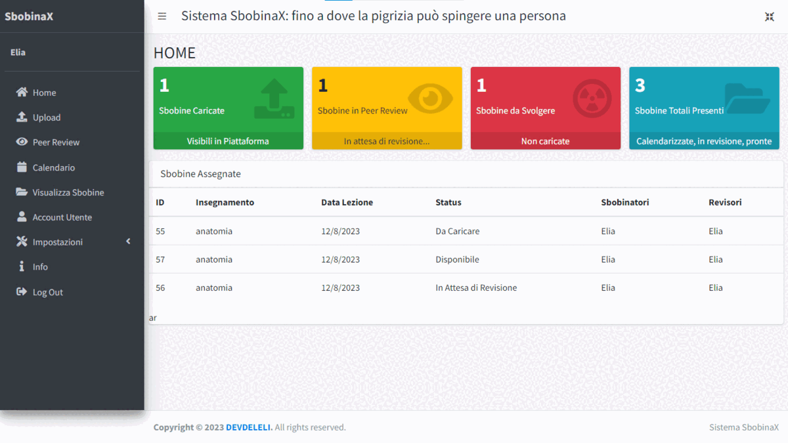

# PhpSbobinaX

## Indice
- [Introduzione](##Introduzione)
- [Installazione](#installazione)
- [Configurazione](#configurazione)
- [Utilizzo](#utilizzo)
- [Suggerimenti](#suggerimenti)
- [Licenza](#licenza)
- [Future Implementazioni](#future-implementazioni)
- [Changelog](#changelog)

## Introduzione
PhpSbobinaX è un gestionale per le sbobine universitarie semplice ma completo, in grado di
gestire le sbobine del semestre corrente, con la possibilità, al termine, di eseguirne
il download per lo storaggio o per la condivisione in altro ambiente (a causa dei limiti di spazio
dell'hosting, ho scelto di concentrarmi su un singolo semestre).

Il gestionale è stato sviluppato in PHP, con l'ausilio di Javascript e CSS, e utilizza un database
MySQL per la memorizzazione dei dati. Sfortunatamente, non è disponibile un installer, quindi
per l'installazione è necessario eseguire manualmente le operazioni descritte nella sezione apposita,
eventualmente aiutandosi con il file `install.sql` per la creazione del database.

Sono di seguito riportate alcune informazioni base. Per ulteriori informazioni, è possibile consultare
la documentazione presente nella cartella `Docs`, ove sono riportati i [manuali utente](Docs/Manuale.pdf) (unico per 
SuperUser ed utente normale) e di installazione, oltre ad una descrizione dei database ed il file `install.sql`.

## Installazione
Per installare il gestionale, è necessario eseguire le seguenti operazioni:
1. Creare un database MySQL, nominandolo "sbobinax" (in alternativa è necessario modificare il file `db_configurator.php`).
Qualora non fosse possibile creare un database, è possibile utilizzare un database già esistente, ma è necessario
modificare il file `db_configurator.php` inserendo i dati di accesso al database;
2. Selezionare "import" dalla barra superiore presente in phpMyAdmin (anche in un database già esistente);
3. Selezionare il file `install.sql` e confermare l'importazione;
4. Copiare i file del gestionale nella ROOT del sito web (o in alternativa nella cartella desiderata);
5. Modificare il file `db_configurator.php` inserendo i dati di accesso al database;
6. PER IL PRIMO ACCESSO, usare la seguente coppia di matricola e password: '123' e 'password', generare un nuovo
account utente con permessi di SuperUser e CANCELLARE l'account di default.

## Configurazione
A dire il vero, una volta installato il gestionale, non è necessario effettuare alcuna configurazione.
Tuttavia, prima di poter iniziare a caricare le sbobine, è necessario creare almeno un insegnamento,
programmare almeno una sbobina ed assegnare la stessa ad almeno uno sbobinatore e revisore (possono coincidere).
Tutte queste operazioni sono effettuabili solamente dal SuperUser. L'accesso tramite un account normale comporterà
la comparsa di un messaggio di errore.

## Utilizzo
Per ogni informazione, si rimanda alla lettura dei manuali utente presenti nella cartella `Docs`. 
Sono inoltre presenti, al canale [YouTube](https://www.youtube.com/@devdeleli), una serie di video che ne 
dimostrano il funzionamento.

## Suggerimenti
Per ogni suggerimento, segnalazione bug o richiesta di aiuto, è possibile riempire l'apposito form presente
su GitHub.

## Licenza
Il progetto è rilasciato sotto licenza MIT. Per ulteriori informazioni, si rimanda alla lettura del file `LICENSE`.

## Future Implementazioni

Di seguito inserisco le funzionalità che intendo implementare nelle successive versioni. È possibile proporre funzionalità compilando [questo link](https://www.delelimed.github.io/request-informations) oppure tramite l'apposito form su GitHub. NON sono previsti rilasci fissi, l'applicazione verrà aggiornata "a tempo perso".

- Implementare il REPORT sbobine per segnalare problematiche
- Implementare la possibilità di cambiare il turno in autonomia (in corso...)
- Implementare auto upload da Google drive
- Nascondere id generale e mostrare solo progressivo sbobina (in corso...)
- Facilità upload con pulsanti, senza necessità di ricordare ID (in corso...)
- Rigetto postumo da admin, in caso di file corrotto (con notifica su telegram)
- Report per lezione non svolta
- Implementazione sistema di notifiche
- Implementazione di "counter" per indicare le sbobine caricate dall'ultimo login

## Changelog

- 2.1(27/09/2023)
  - Aggiunto invio di notifiche automatiche su un gruppo telegram quando ho un upload o un'approvazione
  di sbobina, oppure all'inserimento di un nuovo esonero

- 2.0 (21/09/2023)
  - Aggiunta una PWA
  - Aggiunta la possibilità di prenotare le sbobine come revisore o sbobinatore
  - Aggiunto l'obbligo di indicare il motivo del rigetto di una sbobina
  - Aumentata la sicurezza generale
  - Aggiunta criptazione delle sbobine caricate (con cambio di estensione: .pdf -> .SBOBI)
  - Aggiunta la possibilità di gestire la prenotazione degli esoneri (registrati o non registrati) e di cancellare la propria prenotazione (registrati)

- PR 1.1.0 (12/08/2023)
  - Sistemata denominazione tabelle database
  - Aggiunta possibilità di definire numero dei malus
  - Aggiunto blocco automatico ed IRREVOCABILE dell'account al raggiungimento del numero di malus

- PR 1.0.0 (24/07/2023)
  - Prima versione stabile

